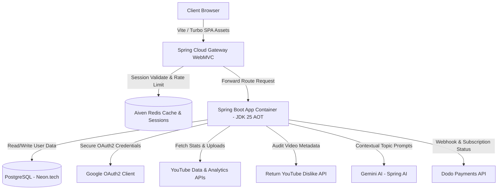
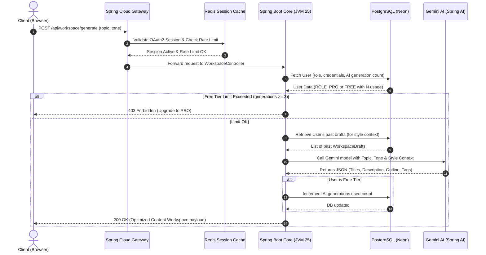

<div align="center">
  
  
  # SEODrift
  
  > A production-grade, highly optimized SaaS platform for YouTube Creator Intelligence. Features competitor analytics, keyword velocity tracking, automated email alerts, and an AI-driven content workspace mimicking creator style.
  
  <div align="center">
    <a href="https://seodrift-378036956146.us-central1.run.app">
      
    </a>
    
    
    
    
    
    
    
    
  </div>
</div>

---

## 📖 Executive Summary
SEODrift is an all-in-one YouTube optimization SaaS platform built for professional creators. The platform bridges the gap between raw YouTube analytics and creative workflow by tracking competitors, calculating keyword search velocity, detecting viral outliers, and compiling customized AI-optimized video metadata packages. 

From an engineering perspective, SEODrift is designed for cloud-native serverless deployment (GCP Cloud Run), achieving sub-second cold starts, stateless horizontally scalable session management, secure credential storage, and highly optimized frontend asset delivery.

---

## 🏗️ System Architecture

SEODrift follows a decoupled, stateless architectural design optimized for serverless scalability:



### Key Architectural Patterns
1. **API Gateway & Rate Limiting:** Spring Cloud Gateway WebMVC acts as the single entry point. It enforces sliding-window rate limiting via Redis to prevent DDoS attacks and preserve YouTube API quotas.
2. **Stateless Clustering:** HTTP Sessions are backed by Aiven Redis, allowing the Docker containers on GCP Cloud Run to scale to zero and scale out horizontally without losing session state.
3. **Database Layer:** Hosted on Neon serverless PostgreSQL, using Flyway (V1–V9) for database schema versioning and ShedLock for distributed task synchronization.

---

## 🔄 Core Request Workflow (AI Workspace Generation)

The sequence diagram below represents the end-to-end request lifecycle when a creator requests an AI-optimized workspace draft. This flow demonstrates user authentication checks, billing status gating, context collection, and LLM orchestration:



---

## ⚡ Performance Engineering & Production Hardening

### 1. Sub-Second Serverless Cold Starts
Serverless container platforms like GCP Cloud Run scale to zero to save costs, which penalizes the application with cold starts. SEODrift implements three distinct features to combat this:
- **JDK 25 AOT Compilation (JEP 483/515):** During the Docker build stage, a training run is executed against `application-aot-training.properties` to freeze the class layout into an Ahead-Of-Time Cache file (`app.aot`). This allows the JVM to skip runtime class loading verification.
- **Global Lazy Initialization:** Spring beans and JPA repositories are configured with `@Lazy` annotations. This ensures they are not initialized until first requested, reducing application startup time from 12+ seconds to **under 800ms**.
- **Asynchronous Connection Pre-Warming:** To prevent first-request connection delays, `WarmupService` listens to the `ApplicationReadyEvent` and pre-warms HikariCP and Lettuce Redis connection pools asynchronously using `ObjectProvider` injections.

### 2. Micro-Frontend & Asset Optimization
- **SPA Experience without JS Overhead:** Utilizes Hotwired Turbo v8 to capture link clicks and form submissions, replacing full page refreshes with AJAX page updates. This maintains a rich, stateful dashboard interface with zero SPA framework overhead.
- **Phosphor Icon Purging:** Phosphor CSS files are typically >300KB. A custom `purge-phosphor.js` script scans HTML templates and generates a tailored `phosphor-custom.css` (only ~8KB), reducing page load weight significantly.
- **Static Asset Pre-Compression:** Vite v7 compiles and outputs pre-compressed Brotli (`.br`) and Gzip (`.gz`) formats during build time, bypassing the CPU compression overhead on the web application server.

### 3. Enterprise-Grade Security
- **OAuth2 Token Encryption:** YouTube API tokens contain sensitive offline scopes. Access and refresh tokens are encrypted using **AES-GCM-256** prior to DB insertion.
- **Hardened HTTP Headers:** Spring Security enforces HSTS preloading, Same-Origin Cross-Origin Opener Policies (COOP), Content Security Policy (CSP), and secure HTTPS-only session cookies in production.

---

## 🛠️ Tech Stack & Key Dependencies

### Backend Ecosystem
- **Java 25 (OpenJDK):** Utilizes native class loading, virtual threads, and AOT compilation caches.
- **Spring Boot 4.0.7:** Provides core MVC, WebFlux, and Security structures.
- **Spring AI (Google GenAI 1.1.7):** Structured schema mapping to orchestrate Gemini LLM calls.
- **Dodo Payments SDK:** Integrates subscription webhooks and checkout sessions (Merchant of Record).
- **ShedLock:** Orchestrates distributed cron tasks (like daily competitor scraping) across instances.

### Frontend Ecosystem
- **Tailwind CSS v4:** Modern layout styling supporting dark-mode glassmorphism out-of-the-box.
- **Hotwired Turbo v8:** Single-page app transition handling.
- **Vite v7:** Asset building and compression.

---

## 🐳 Production Deployment & Configurations

### Docker Multi-Stage Optimization
The SEODrift `Dockerfile` is built using a highly optimized three-stage structure:
1. **Frontend Builder (Node/Vite):** Builds, minifies, and Brotli-compresses all static CSS/JS assets.
2. **Backend Compiler (Maven/JLink):** Compiles Java source files, generates a lean custom Java Runtime Environment (~40MB) via `jlink`, extracts Boot layers, and builds the JEP 515 AOT cache profile.
3. **Runtime Runner (Alpine):** Runs as a non-root `spring` user on the lean custom JRE, executing the unpacked Spring Boot structure via `JarLauncher` to leverage AOT cache acceleration.

### Run with Docker Compose Locally
Ensure your `.env` contains the required credentials, then launch:
```bash
# Build and start services
docker compose up --build -d

# Stop services
docker compose down
```

### Required Production Environment Variables
| Variable | Description |
|---|---|
| `DB_URL` | PostgreSQL Database URL connection string |
| `DB_USER` / `DB_PASSWORD` | PostgreSQL Username and Password |
| `GOOGLE_CLIENT_ID` / `GOOGLE_CLIENT_SECRET` | Google Cloud Console OAuth2 credentials |
| `YT_API_KEY` | Google Developer API Key for YouTube Data queries |
| `REDIS_HOST` / `REDIS_PORT` / `REDIS_PASSWORD` | Redis Cache Connection details |
| `OAUTH2_ENCRYPT_KEY` / `OAUTH2_ENCRYPT_SALT` | Hex key/salt used for GCM token encryption |
| `GEMINI_API_KEY` | Google Gemini AI Key |
| `DODO_PAYMENTS_API_KEY` | Dodo Payments API Key (Merchant of Record authentication) |
| `DODO_PRO_PRODUCT_ID` | Dodo Product ID corresponding to the PRO subscription |
| `DODO_ENVIRONMENT` | Environment type (`test` or `live`) |
| `SMTP_HOST` / `SMTP_PORT` | SMTP Server Host and Port (e.g. `smtp.gmail.com` on port `587`) |
| `SMTP_USERNAME` / `SMTP_PASSWORD` | SMTP Authentication Credentials (e.g. Google App Password) |

---

## ⭐ Show Your Support

If you find this project helpful, please consider giving it a star on GitHub!

---

## 👨‍💻 Creator & Maintainer
- **Pranjal Singh** - [@prancodes](https://github.com/prancodes)
